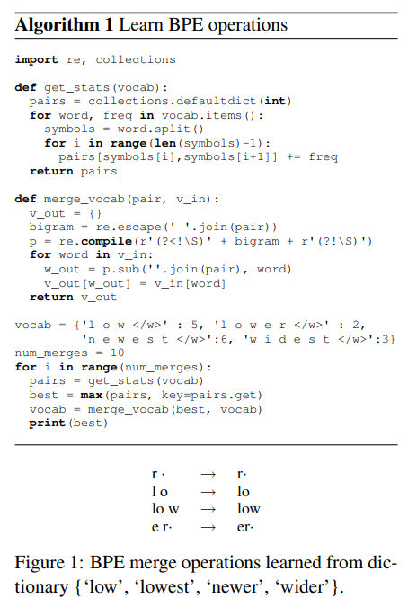
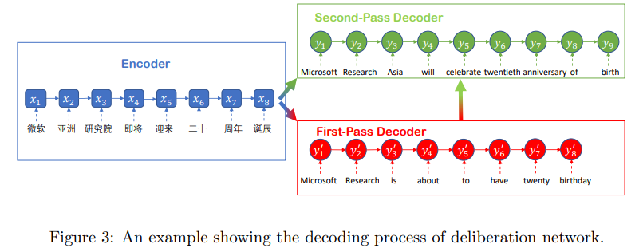
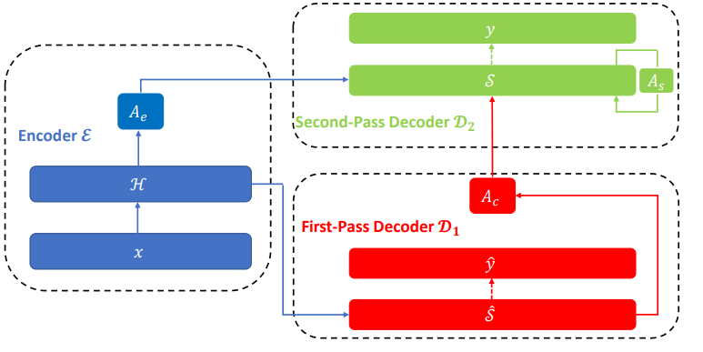
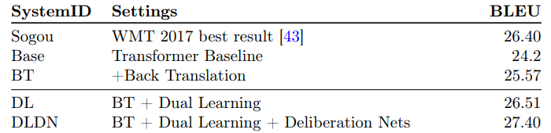

# NMT Model 정리

The University of Edinburgh’s Neural MT Systems for WMT17   
[https://www.aclweb.org/anthology/W17-4739.pdf](https://www.aclweb.org/anthology/W17-4739.pdf)

에든버러 대학교의 NMT

1. BPE 방식을 통해 서브워드 분절   
[https://www.aclweb.org/anthology/P16-1162.pdf](https://www.aclweb.org/anthology/P16-1162.pdf)
   
   
2. model - seq2seq구조인데 LSTM이 아닌 GRU을 사용해서 
   RNN을 구성 Google NMT와 마찬가지로 Residual connection 사용 인코더 4층 디코더 8층쌓아 만들었다. 

optimizer는 Adam 을 사용 

3. 에든버러 대학은 Back-translation도 처음 제안한 곳이다.    
   back-translation, copied-translation 사용
   
Back-translation

[https://arxiv.org/pdf/1511.06709.pdf](https://arxiv.org/pdf/1511.06709.pdf)

데이터중에 병렬데이터가 별로 없다   
근데 단일언어 데이터는 많다.   
그데이터를 사용하자는 방법론이다. 

1. 적은양의 병렬데이터를 사용해서 반대방향 번역모델을 만든다.
2. 단일언어 데이터를 입력해서 결과를 얻는다.
3. 이 반대방향 번역모델에서 나온 데이터는 입력이되고 단일언어 데이터는 출력이 된다. 

이방법이 효과적인 이유는 perplexity가 높은 단어를 입력으로 받기 때문에    
좀 더 유연하게 단어를 생성할수 있기 때문에 성능이 올라간다고 한다. 

copied Translation

[https://www.aclweb.org/anthology/W17-4715.pdf](https://www.aclweb.org/anthology/W17-4715.pdf)

이것도 단일 언어 코퍼스를 활용하는 방식   
source data : target data   
두개에 같은 데이터를 넣어 훈련시키는것   
적용 하니까 대체로 성능이 향상되서 사용하는것 같다.   
이유는 안나와있다.
   
4. 앙상블 기법 사용
 
-  체크 포인트 방식 - 특정 에폭부터 다시 훈련해서 다른모델을 구성   
    → 시간에대해 효율적
-  독립 앙상블 기법 - 독립적으로 다른 하이퍼 파라미터를 사용해 앙상블을 구성  
   → 1의 방식보다 느리지만 더 많은 다양성 산출할 가능성이 높아짐

결과적으로 성능 향상

# Achieving Human Parity on Automatic Chinese to English News Translation

[https://arxiv.org/pdf/1803.05567.pdf](https://arxiv.org/pdf/1803.05567.pdf)

MS 의 NMT

MS는 트랜스포머 구조를 사용해 Seq2Seq 구현

1. 듀얼리티 활용하기

듀얼 지도학습, 듀얼 비지도학습 

2. 딜리버레이션 네트워크

사람도 기사나 논문을 쓸때 초안을 만들고 그 초안을 다듬어서 결과를 만들어낸다.
이를 이용한 기법

인코더에서 문맥 파악후에 첫디코더에서 초안만들어서 두번째 디코더에 입력

실험결과
